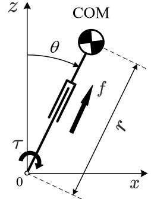
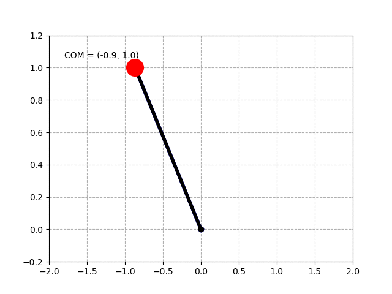
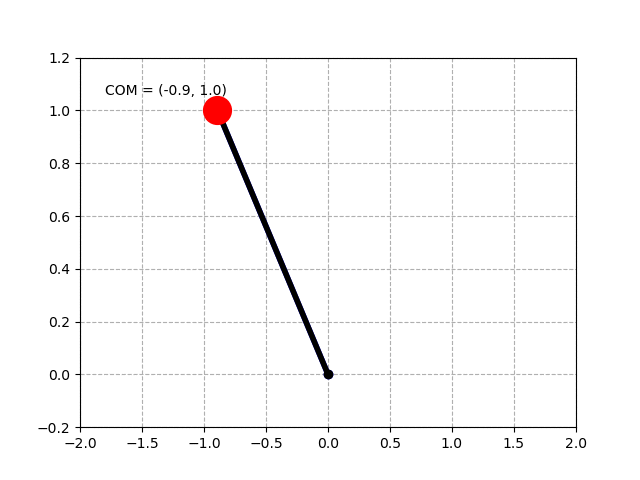

# Bipedal Walking Robots
---
This project is about the models and algorithms for bipedal walking control, including the Linear Inverted Pendunum Model (LIPM) and humandoid robots.

The LIPM is shown as follows:

The calculation for LIPM is implemented with Python 3.6, given different target orbital energy, the LIPM can be controlled to different walking states.

## 1. Single leg

1.1 Giving a initial state for a positve orbital energy.

1.2 Giving a initial state for a negetive orbital energy.

## 2. Double legs

2.1 Giving a zero target orbital energy.

2.2 Giving a positive target orbital energy.

2.3 Giving a negetive target orbital energy.

---

## 文章教程

代码对应的文章教程有两种访问方式，详见：

1. 知乎专栏：https://www.zhihu.com/column/c_1212783320150577152

2. 微信公众号：博士的沙漏。

    

    

获取《仿人机器人》中文版书籍，可关注公众号后，在后台回复【HR】获取下载链接。